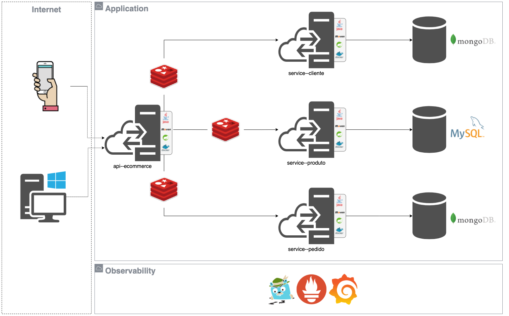
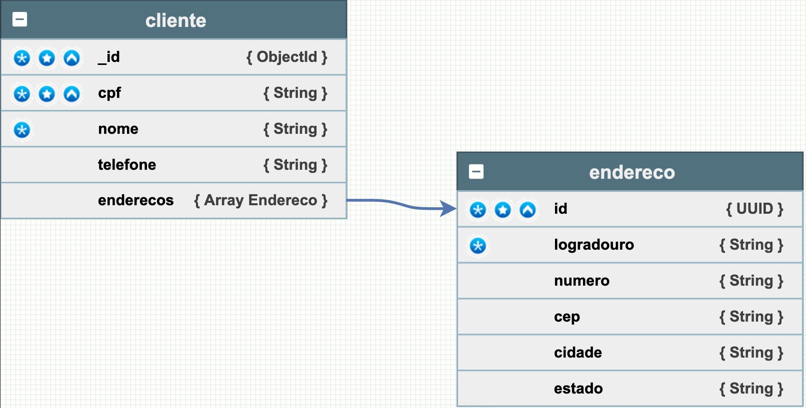
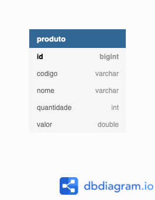
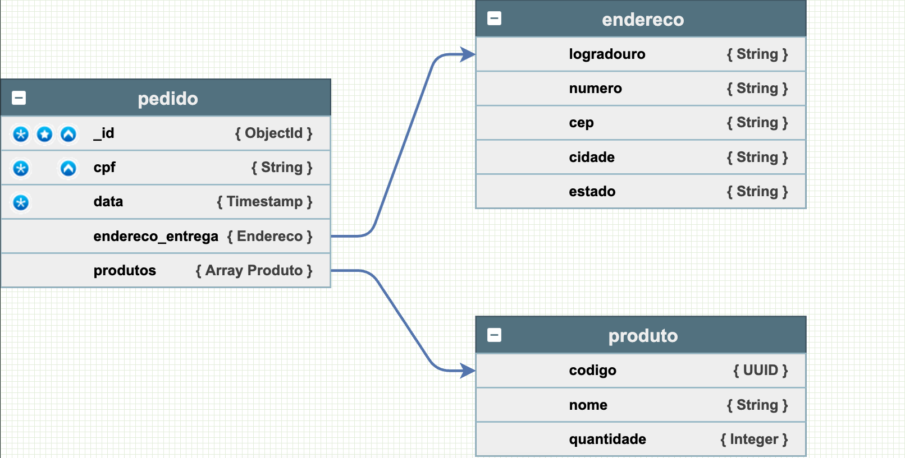

# Projeto de conclusão da disciplina de Persistence da FIAP (MBA)

Esse projeto tem o objetivo de demonstrar a utilização de diferentes tipos de bancos de dados (SQL e NoSQL), nos contextos de persistência e caching.

# Dependências

- Java 11
- Maven
- Spring Boot 2.6.1
- Docker

# Arquitetura

Foi utilizada uma arquitetura de micro-serviços, visando utilizar diferentes paradigmas de bancos de dados para fins didáticos.

# Diagrama das Bases de Dados

- ### service-cliente

- ### service--produto

- ### service--pedido
